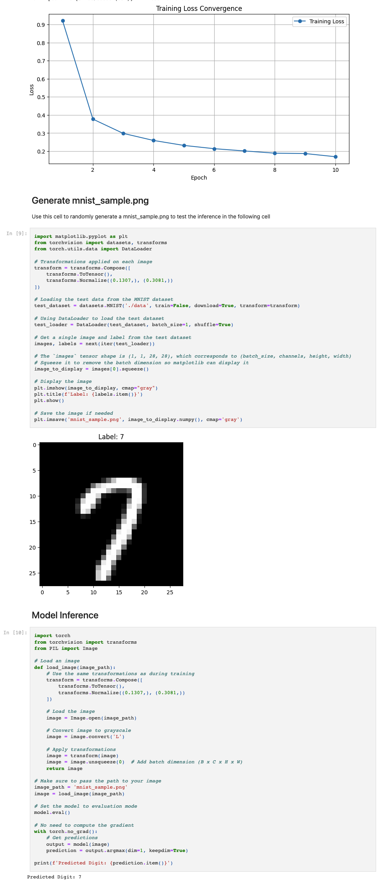

# Convolutional Neural Network for MNIST Classification

This repository contains the implementation of a Convolutional Neural Network (CNN) for classifying handwritten digits from the MNIST dataset. The model is implemented using PyTorch, a popular machine learning library for Python.

## Model Architecture

The `ConvNet` class defines a simple CNN with two convolutional layers followed by two fully connected layers. Dropout is applied after the second convolutional layer and the first fully connected layer to prevent overfitting.

## Dataset

The MNIST dataset is used, which consists of 28x28 pixel grayscale images of handwritten digits. The dataset is automatically downloaded using torchvision's datasets module.

## Dependencies

- Python 3.x
- PyTorch
- torchvision
- matplotlib

To install PyTorch and torchvision, please follow the instructions on the [official PyTorch website](https://pytorch.org/get-started/locally/).

## Training

The model is trained using Stochastic Gradient Descent (SGD) with a learning rate of 0.01 and momentum of 0.5. The training process is defined in the `train` function, which is executed over 10 epochs.

## Usage

Please run mnist.ipynb (Jupyter Notebook)

